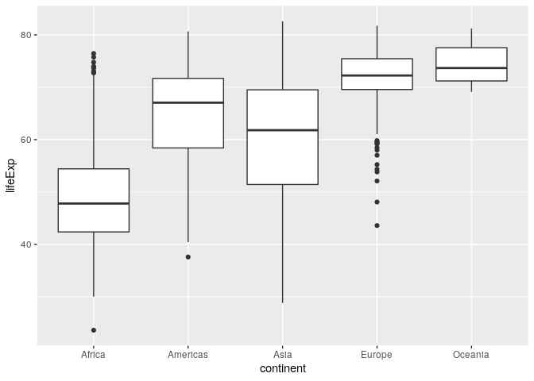

Skateboard
================

**Collapse all chunks with Alt+O / Cmd+Option+O**

  - Use the packages tidyverse and here.

<!-- end list -->

``` r
library(_________)
_______(here)
```

    #> ── Attaching packages ──────────────────────────────────── tidyverse 1.3.0 ──
    #> ✓ ggplot2 3.3.2     ✓ purrr   0.3.4
    #> ✓ tibble  3.0.3     ✓ dplyr   1.0.1
    #> ✓ tidyr   1.1.1     ✓ stringr 1.4.0
    #> ✓ readr   1.3.1     ✓ forcats 0.5.0
    #> ── Conflicts ─────────────────────────────────────── tidyverse_conflicts() ──
    #> x dplyr::filter() masks stats::filter()
    #> x dplyr::lag()    masks stats::lag()
    #> here() starts at /home/rstudio/tidy-ds

You are about to read data but this code fails. The path is unsafe, fix
it:

  - Create a safe path with `here()` and retry.
  - Experiment with “Knit \> Knit Directory”.

<!-- end list -->

``` r
read_csv("data/gapminder.csv")
#> Error: 'data/gapminder.csv' does not exist in current working directory ('/home/rstudio/tidy-ds/R').
```

  - Read the csv file; Create a safe path to “data/gampinder.csv” with
    `here()`.

<!-- end list -->

``` r
gapminder <- ________(here("____", "gapminder.csv"))
```

    #> Parsed with column specification:
    #> cols(
    #>   country = col_character(),
    #>   continent = col_character(),
    #>   year = col_double(),
    #>   lifeExp = col_double(),
    #>   pop = col_double(),
    #>   gdpPercap = col_double()
    #> )

  - Print and explore `gampinder` under the chunk and with `view()`.

<!-- end list -->

``` r
_________
```

    #> # A tibble: 1,704 x 6
    #>    country     continent  year lifeExp      pop gdpPercap
    #>    <chr>       <chr>     <dbl>   <dbl>    <dbl>     <dbl>
    #>  1 Afghanistan Asia       1952    28.8  8425333      779.
    #>  2 Afghanistan Asia       1957    30.3  9240934      821.
    #>  3 Afghanistan Asia       1962    32.0 10267083      853.
    #>  4 Afghanistan Asia       1967    34.0 11537966      836.
    #>  5 Afghanistan Asia       1972    36.1 13079460      740.
    #>  6 Afghanistan Asia       1977    38.4 14880372      786.
    #>  7 Afghanistan Asia       1982    39.9 12881816      978.
    #>  8 Afghanistan Asia       1987    40.8 13867957      852.
    #>  9 Afghanistan Asia       1992    41.7 16317921      649.
    #> 10 Afghanistan Asia       1997    41.8 22227415      635.
    #> # … with 1,694 more rows

  - Boxplot `lifeExp` for each continent `continent` (see
    `?geom_boxplot()`).

<!-- end list -->

``` r
ggplot(data = _________, aes(x = _________, y = _______)) +
  geom________()
```

<!-- -->

## Takeaways

Import:

  - Use `read_csv()` to read a single .csv file.
  - Use `here()` to create safe paths with `here()`, particularly in
    rmarkdown.

Visualise:

  - Start your plots from this template:

<!-- end list -->

    ggplot(data = <DATA>) +
      <GEOM_FUNCTION>(mapping = aes(<MAPPINGS>))

Communicate:

  - Use github\_document to report your analysis as a web page on
    GitHub.
  - Set the chunk options you like.

Other:

  - Use all packages in the tidyverse with `library(tidyverse)`.
  - Assign values to objects with `<-`.
  - Compose functions like `g(f(x))` or `x %>% f() %>% g()`.
