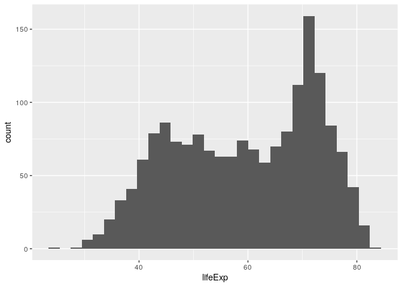

Scooter
================

**Collapse all chunks with Alt+O / Cmd+Option+O**

## Review

  - Packages.

<!-- end list -->

``` r
library(tidyverse)
#> ── Attaching packages ─────────────────────────────────── tidyverse 1.3.0 ──
#> ✓ ggplot2 3.3.2     ✓ purrr   0.3.4
#> ✓ tibble  3.0.3     ✓ dplyr   1.0.1
#> ✓ tidyr   1.1.1     ✓ stringr 1.4.0
#> ✓ readr   1.3.1     ✓ forcats 0.5.0
#> ── Conflicts ────────────────────────────────────── tidyverse_conflicts() ──
#> x dplyr::filter() masks stats::filter()
#> x dplyr::lag()    masks stats::lag()
library(here)
#> here() starts at /home/rstudio/tidy-ds
```

  - Import – [practice safe paths](https://rstats.wtf/safe-paths.html).

<!-- end list -->

``` r
gapminder <- read_csv(here("data", "gapminder.csv"))
#> Parsed with column specification:
#> cols(
#>   country = col_character(),
#>   continent = col_character(),
#>   year = col_double(),
#>   lifeExp = col_double(),
#>   pop = col_double(),
#>   gdpPercap = col_double()
#> )
```

# Your turn

  - Explore.

<!-- end list -->

``` r
gapminder %>% _______()
```

    #> Rows: 1,704
    #> Columns: 6
    #> $ country   <chr> "Afghanistan", "Afghanistan", "Afghanistan", "Afghanistan",…
    #> $ continent <chr> "Asia", "Asia", "Asia", "Asia", "Asia", "Asia", "Asia", "As…
    #> $ year      <dbl> 1952, 1957, 1962, 1967, 1972, 1977, 1982, 1987, 1992, 1997,…
    #> $ lifeExp   <dbl> 28.801, 30.332, 31.997, 34.020, 36.088, 38.438, 39.854, 40.…
    #> $ pop       <dbl> 8425333, 9240934, 10267083, 11537966, 13079460, 14880372, 1…
    #> $ gdpPercap <dbl> 779.4453, 820.8530, 853.1007, 836.1971, 739.9811, 786.1134,…

  - Using `filter()`, subset rows where `continent` is “Europe”.

<!-- end list -->

``` r
continents <- c("________", "______")
_________ %>% ______(continent %in% continents)
```

    #> # A tibble: 360 x 6
    #>    country continent  year lifeExp     pop gdpPercap
    #>    <chr>   <chr>     <dbl>   <dbl>   <dbl>     <dbl>
    #>  1 Albania Europe     1952    55.2 1282697     1601.
    #>  2 Albania Europe     1957    59.3 1476505     1942.
    #>  3 Albania Europe     1962    64.8 1728137     2313.
    #>  4 Albania Europe     1967    66.2 1984060     2760.
    #>  5 Albania Europe     1972    67.7 2263554     3313.
    #>  6 Albania Europe     1977    68.9 2509048     3533.
    #>  7 Albania Europe     1982    70.4 2780097     3631.
    #>  8 Albania Europe     1987    72   3075321     3739.
    #>  9 Albania Europe     1992    71.6 3326498     2497.
    #> 10 Albania Europe     1997    73.0 3428038     3193.
    #> # … with 350 more rows

Notice the `value` of the `continent` `param` from the YAML header at
the top.

``` r
params
#> $continent
#> [1] "Africa"   "Americas" "Asia"     "Europe"   "Oceania"
```

  - Edit the YAML header so `param` `continent` takes the value Europe.

  - Using `filter()`, subset rows where `continent` is
    `params$continent`.

  - Assign the result to `filtered`.

<!-- end list -->

``` r
filtered <- _________ %>% 
  ______(continent %in% ______$continent)

filtered
```

    #> # A tibble: 1,704 x 6
    #>    country     continent  year lifeExp      pop gdpPercap
    #>    <chr>       <chr>     <dbl>   <dbl>    <dbl>     <dbl>
    #>  1 Afghanistan Asia       1952    28.8  8425333      779.
    #>  2 Afghanistan Asia       1957    30.3  9240934      821.
    #>  3 Afghanistan Asia       1962    32.0 10267083      853.
    #>  4 Afghanistan Asia       1967    34.0 11537966      836.
    #>  5 Afghanistan Asia       1972    36.1 13079460      740.
    #>  6 Afghanistan Asia       1977    38.4 14880372      786.
    #>  7 Afghanistan Asia       1982    39.9 12881816      978.
    #>  8 Afghanistan Asia       1987    40.8 13867957      852.
    #>  9 Afghanistan Asia       1992    41.7 16317921      649.
    #> 10 Afghanistan Asia       1997    41.8 22227415      635.
    #> # … with 1,694 more rows

  - From `filtered`, exclude `country` and `continent` with `select()`.

  - Store the result as `selected`.

<!-- end list -->

``` r
selected <- filtered %>% 
  ______(-country, -_________)
  select(-country, -continent)

selected
```

    #> # A tibble: 1,704 x 4
    #>     year lifeExp      pop gdpPercap
    #>    <dbl>   <dbl>    <dbl>     <dbl>
    #>  1  1952    28.8  8425333      779.
    #>  2  1957    30.3  9240934      821.
    #>  3  1962    32.0 10267083      853.
    #>  4  1967    34.0 11537966      836.
    #>  5  1972    36.1 13079460      740.
    #>  6  1977    38.4 14880372      786.
    #>  7  1982    39.9 12881816      978.
    #>  8  1987    40.8 13867957      852.
    #>  9  1992    41.7 16317921      649.
    #> 10  1997    41.8 22227415      635.
    #> # … with 1,694 more rows

  - Do it again but subset columns by type with `select(where(` and with
    `keep()`.
  - Store the result as `selected1` and `selected2`; compare with
    `identical()`.

<!-- end list -->

``` r
selected1 <- filtered %>% ______(where(is._______))
_________ %>% identical(selected)

selected2 <- filtered %>% ____(is._______)
_________ %>% identical(selected)
```

    #> [1] TRUE
    #> [1] TRUE

## A note on iteration

You’ve just solved an iteration problem; let’s make it explicit with
`for()`:

``` r
# Pre-allocate
pick <- logical(ncol(filtered))
# Iterate
for (i in seq_along(filtered)) {
  pick[[i]] <- is.numeric(filtered[[i]])
}
selected3 <- filtered[pick]
selected3 %>% identical(selected)
#> [1] TRUE
```

> Of course, someone has to write loops. It doesn’t have to be you. —
> Jenny Bryan

In this case, you could also discard character columns with `discard()`:

``` r
# Same
selected4 <- filtered %>% discard(is.character)
selected4 %>% identical(selected)
#> [1] TRUE
```

BTW, my iteration using `identical()` was inelegant; let’s improve it:

``` r
to_compare <- list(selected1, selected2, selected3, selected4)

to_compare %>% map_lgl(identical, selected)
#> [1] TRUE TRUE TRUE TRUE

# Same
to_compare %>% map_lgl(~identical(.x, selected))
#> [1] TRUE TRUE TRUE TRUE

# Same
to_compare %>% map_lgl(function(.x) identical(.x, selected))
#> [1] TRUE TRUE TRUE TRUE
```

You’ll learn more about `map()` and friends later.

## Your turn

  - Plot a histogram of `lifeExp` (see `?geom_histogram`).

<!-- end list -->

``` r
ggplot(data = selected, aes(lifeExp)) +
  geom_histogram()
```

    #> `stat_bin()` using `bins = 30`. Pick better value with `binwidth`.

<!-- -->

*Histogram of life expectancy in Africa, Americas, Asia, Europe, Oceania
between 1952, 2007.*

  - Knit this report for different continents: *Knit \> Knit with
    Parameters …*.
