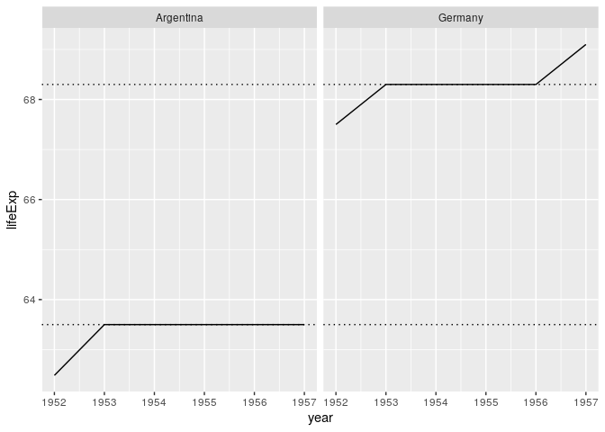

Bicycle
================

## Create a presentation

  - Render this document with “Knit” – as usual.

Now render is as an “ioslides\_resentation” from the console: Run this
code:

    rmarkdown::render(
      input = here("R/03_bicycle_you.Rmd"), 
      output_format = "ioslides_presentation"
    )

The output file is at “R/03\_bicycle\_you.html”; open it.

## Packages

``` r
library(tidyverse)
#> ── Attaching packages ──────────────────── tidyverse 1.3.0 ──
#> ✓ ggplot2 3.3.2     ✓ purrr   0.3.4
#> ✓ tibble  3.0.3     ✓ dplyr   1.0.2
#> ✓ tidyr   1.1.1     ✓ stringr 1.4.0
#> ✓ readr   1.3.1     ✓ forcats 0.5.0
#> ── Conflicts ─────────────────────── tidyverse_conflicts() ──
#> x dplyr::filter() masks stats::filter()
#> x dplyr::lag()    masks stats::lag()
library(here)
#> here() starts at /home/mauro/git/tidy-ds
library(fs)
library(vroom)
```

## Definition of tidy data


## From messy to tidy


## Demo: A messy dataset

This toy dataset is messy. Why?

``` r
toy <- tribble(
  ~country, ~"2011", ~"2012", ~"2013",
      "fr",    7000,    6900,    7000,
      "de",    5800,    6000,    6200,
      "us",   15000,   14000,   13000
)
```

## Demo `pivot_longer()`

To tidy this dataset we pivot over all columns except `country`. We may
exclude `country` with `-` or select all other columns with
`where(is.numeric)`.

``` r
toy %>% pivot_longer(where(is.numeric))
#> # A tibble: 9 x 3
#>   country name  value
#>   <chr>   <chr> <dbl>
#> 1 fr      2011   7000
#> 2 fr      2012   6900
#> 3 fr      2013   7000
#> 4 de      2011   5800
#> 5 de      2012   6000
#> 6 de      2013   6200
#> 7 us      2011  15000
#> 8 us      2012  14000
#> 9 us      2013  13000
```

## Import

Import all datasets in “data/by-continent” into a single data frame:
`messy`.

``` r
paths <- dir_ls(here("data", "by-continent"))
messy <- suppressMessages(vroom(paths))
messy
#> # A tibble: 142 x 38
#>    continent country gdpPercap_1952 gdpPercap_1957 gdpPercap_1962 gdpPercap_1967
#>    <chr>     <chr>            <dbl>          <dbl>          <dbl>          <dbl>
#>  1 Africa    Algeria          2449.          3014.          2551.          3247.
#>  2 Africa    Angola           3521.          3828.          4269.          5523.
#>  3 Africa    Benin            1063.           960.           949.          1036.
#>  4 Africa    Botswa…           851.           918.           984.          1215.
#>  5 Africa    Burkin…           543.           617.           723.           795.
#>  6 Africa    Burundi           339.           380.           355.           413.
#>  7 Africa    Camero…          1173.          1313.          1400.          1508.
#>  8 Africa    Centra…          1071.          1191.          1193.          1136.
#>  9 Africa    Chad             1179.          1308.          1390.          1197.
#> 10 Africa    Comoros          1103.          1211.          1407.          1876.
#> # … with 132 more rows, and 32 more variables: gdpPercap_1972 <dbl>,
#> #   gdpPercap_1977 <dbl>, gdpPercap_1982 <dbl>, gdpPercap_1987 <dbl>,
#> #   gdpPercap_1992 <dbl>, gdpPercap_1997 <dbl>, gdpPercap_2002 <dbl>,
#> #   gdpPercap_2007 <dbl>, lifeExp_1952 <dbl>, lifeExp_1957 <dbl>,
#> #   lifeExp_1962 <dbl>, lifeExp_1967 <dbl>, lifeExp_1972 <dbl>,
#> #   lifeExp_1977 <dbl>, lifeExp_1982 <dbl>, lifeExp_1987 <dbl>,
#> #   lifeExp_1992 <dbl>, lifeExp_1997 <dbl>, lifeExp_2002 <dbl>,
#> #   lifeExp_2007 <dbl>, pop_1952 <dbl>, pop_1957 <dbl>, pop_1962 <dbl>,
#> #   pop_1967 <dbl>, pop_1972 <dbl>, pop_1977 <dbl>, pop_1982 <dbl>,
#> #   pop_1987 <dbl>, pop_1992 <dbl>, pop_1997 <dbl>, pop_2002 <dbl>,
#> #   pop_2007 <dbl>
```

## Tidy with `pivot_longer()`: Task

  - Pivot over all numeric columns.
  - Store the result as `longer`.
  - Use `names_to = metric` (see `?pivot_longer()`).

<!-- end list -->

``` r
longer <- messy %>% 
  pivot_longer(where(is.numeric), names_to = "metric")

longer
```

## Tidy with `pivot_longer()`: Result

    #> # A tibble: 5,112 x 4
    #>    continent country metric         value
    #>    <chr>     <chr>   <chr>          <dbl>
    #>  1 Africa    Algeria gdpPercap_1952 2449.
    #>  2 Africa    Algeria gdpPercap_1957 3014.
    #>  3 Africa    Algeria gdpPercap_1962 2551.
    #>  4 Africa    Algeria gdpPercap_1967 3247.
    #>  5 Africa    Algeria gdpPercap_1972 4183.
    #>  6 Africa    Algeria gdpPercap_1977 4910.
    #>  7 Africa    Algeria gdpPercap_1982 5745.
    #>  8 Africa    Algeria gdpPercap_1987 5681.
    #>  9 Africa    Algeria gdpPercap_1992 5023.
    #> 10 Africa    Algeria gdpPercap_1997 4797.
    #> # … with 5,102 more rows

## `separate()`: Task

Mess things up again:

  - `metric` is still messy; tidy it with `separate()` and `c("metric",
    "year")`.
  - Store the result as `tidy`.

<!-- end list -->

``` r
tidy <- longer %>% separate(metric, c("metric", "year"))
tidy
```

## `separate()`: Result

    #> # A tibble: 5,112 x 5
    #>    continent country metric    year  value
    #>    <chr>     <chr>   <chr>     <chr> <dbl>
    #>  1 Africa    Algeria gdpPercap 1952  2449.
    #>  2 Africa    Algeria gdpPercap 1957  3014.
    #>  3 Africa    Algeria gdpPercap 1962  2551.
    #>  4 Africa    Algeria gdpPercap 1967  3247.
    #>  5 Africa    Algeria gdpPercap 1972  4183.
    #>  6 Africa    Algeria gdpPercap 1977  4910.
    #>  7 Africa    Algeria gdpPercap 1982  5745.
    #>  8 Africa    Algeria gdpPercap 1987  5681.
    #>  9 Africa    Algeria gdpPercap 1992  5023.
    #> 10 Africa    Algeria gdpPercap 1997  4797.
    #> # … with 5,102 more rows

## `unite()` and `pivot_wider()`: Task

  - Use `unite()` to unite the columns `metric` and `year` as “metric”.
  - Use `pivot_wider()` to take the `names_from` the column `metric` and
    create new columns – taking `values_from` the column `value`.
  - Is the output wider than the input?

<!-- end list -->

``` r
tidy %>% 
  unite("metric", metric, year) %>% 
  pivot_wider(names_from = metric, values_from = value)
```

## `unite()` and `pivot_wider()`: Result

    #> # A tibble: 142 x 38
    #>    continent country gdpPercap_1952 gdpPercap_1957 gdpPercap_1962 gdpPercap_1967
    #>    <chr>     <chr>            <dbl>          <dbl>          <dbl>          <dbl>
    #>  1 Africa    Algeria          2449.          3014.          2551.          3247.
    #>  2 Africa    Angola           3521.          3828.          4269.          5523.
    #>  3 Africa    Benin            1063.           960.           949.          1036.
    #>  4 Africa    Botswa…           851.           918.           984.          1215.
    #>  5 Africa    Burkin…           543.           617.           723.           795.
    #>  6 Africa    Burundi           339.           380.           355.           413.
    #>  7 Africa    Camero…          1173.          1313.          1400.          1508.
    #>  8 Africa    Centra…          1071.          1191.          1193.          1136.
    #>  9 Africa    Chad             1179.          1308.          1390.          1197.
    #> 10 Africa    Comoros          1103.          1211.          1407.          1876.
    #> # … with 132 more rows, and 32 more variables: gdpPercap_1972 <dbl>,
    #> #   gdpPercap_1977 <dbl>, gdpPercap_1982 <dbl>, gdpPercap_1987 <dbl>,
    #> #   gdpPercap_1992 <dbl>, gdpPercap_1997 <dbl>, gdpPercap_2002 <dbl>,
    #> #   gdpPercap_2007 <dbl>, lifeExp_1952 <dbl>, lifeExp_1957 <dbl>,
    #> #   lifeExp_1962 <dbl>, lifeExp_1967 <dbl>, lifeExp_1972 <dbl>,
    #> #   lifeExp_1977 <dbl>, lifeExp_1982 <dbl>, lifeExp_1987 <dbl>,
    #> #   lifeExp_1992 <dbl>, lifeExp_1997 <dbl>, lifeExp_2002 <dbl>,
    #> #   lifeExp_2007 <dbl>, pop_1952 <dbl>, pop_1957 <dbl>, pop_1962 <dbl>,
    #> #   pop_1967 <dbl>, pop_1972 <dbl>, pop_1977 <dbl>, pop_1982 <dbl>,
    #> #   pop_1987 <dbl>, pop_1992 <dbl>, pop_1997 <dbl>, pop_2002 <dbl>,
    #> #   pop_2007 <dbl>

## Create a small dataset: Review

Let’s create a small dataset to play with. Explain what this code does.

You should already understand this code:

  - Remove `continent`.
  - Subset life expectancy values for Argentina and Germany before 1962.
  - Move the life expectancy values to the column `lifeExp`.

## Create a small dataset: Review

``` r
subset1 <- tidy %>% 
  select(-continent) %>% 
  filter(
    country %in% c("Argentina", "Germany"), 
    metric == "lifeExp",
    year < 1962
  ) %>% 
  pivot_wider(names_from = metric)

subset1
#> # A tibble: 4 x 3
#>   country   year  lifeExp
#>   <chr>     <chr>   <dbl>
#> 1 Argentina 1952     62.5
#> 2 Argentina 1957     64.4
#> 3 Germany   1952     67.5
#> 4 Germany   1957     69.1
```

## Create a small dataset: Task

Now add a new column `mean`, holding the mean `lifeExp` for each
`country`:

  - Use `group_by()`.
  - Use `mutate()` to calculate mean `lifeExp` and to make `year`
    numeric.
  - `ungroup()`.
  - Store the result as `subset2`.

<!-- end list -->

``` r
subset2 <- subset1 %>% 
  group_by(country) %>% 
  mutate(mean = mean(lifeExp), year = as.numeric(year)) %>% 
  ungroup()

subset2
```

## Create a small dataset: Result

    #> # A tibble: 4 x 4
    #>   country    year lifeExp  mean
    #>   <chr>     <dbl>   <dbl> <dbl>
    #> 1 Argentina  1952    62.5  63.4
    #> 2 Argentina  1957    64.4  63.4
    #> 3 Germany    1952    67.5  68.3
    #> 4 Germany    1957    69.1  68.3

## Create a small dataset: Tweak

Let’s degrade this dataset a bit for a later example.

``` r
arg_ger <- subset2 %>% slice(-2) %>% select(-mean)
```

## `complete()`: What’s missing?

Say you have the dataset `arg_ger`; it is missing data in between 1952
and 1957, but – somehow – you know the historical mean for each country.
Let’s use this data and knowledge to try fill the missing data.

``` r
arg_ger
#> # A tibble: 3 x 3
#>   country    year lifeExp
#>   <chr>     <dbl>   <dbl>
#> 1 Argentina  1952    62.5
#> 2 Germany    1952    67.5
#> 3 Germany    1957    69.1

# Historical mean life expectancy
mean_argentina <- 63.5
mean_germany <- 68.3
```

## `complete()`: Task

  - Make the implicit missing data explicit with `complete()`.

<!-- end list -->

``` r
arg_ger %>% complete(country, year)
```

## `complete()`: Result

    #> # A tibble: 4 x 3
    #>   country    year lifeExp
    #>   <chr>     <dbl>   <dbl>
    #> 1 Argentina  1952    62.5
    #> 2 Argentina  1957    NA  
    #> 3 Germany    1952    67.5
    #> 4 Germany    1957    69.1

## `fill`: Task

Extend the previous code:

  - Fill the missing values of `lifeExp` with the value in
    `mean_argentina`.
  - You’ll need to pass each value to fill as a named list.
  - Store the result as `filled`.

<!-- end list -->

``` r
filled <- arg_ger %>% 
  complete(country, year, fill = list(lifeExp = mean_argentina))

filled
```

## `fill`: Result

    #> # A tibble: 4 x 3
    #>   country    year lifeExp
    #>   <chr>     <dbl>   <dbl>
    #> 1 Argentina  1952    62.5
    #> 2 Argentina  1957    63.5
    #> 3 Germany    1952    67.5
    #> 4 Germany    1957    69.1

## `full_seq()`: Task

Let’s now complete the missing data in between 1952-1957.

  - Use `pull()` to pull the available years.
  - Use `full_seq()` to produce the full sequence of every year in the
    range.
  - Store the result as `all_years`.

<!-- end list -->

``` r
all_years <- filled %>% 
  pull(year) %>% 
  full_seq(period = 1)

all_years
```

## `full_seq()`: Result

    #> [1] 1952 1953 1954 1955 1956 1957

## `fill()`: Task

  - Use `all_years` to `complete()` `year`; also complete `country` with
    itself.
  - Store the result as `full_mean`.

<!-- end list -->

``` r
full_mean <- filled %>% complete(year = all_years, country = country)

full_mean
```

## `fill()`: Result

    #> # A tibble: 12 x 3
    #>     year country   lifeExp
    #>    <dbl> <chr>       <dbl>
    #>  1  1952 Argentina    62.5
    #>  2  1952 Germany      67.5
    #>  3  1953 Argentina    NA  
    #>  4  1953 Germany      NA  
    #>  5  1954 Argentina    NA  
    #>  6  1954 Germany      NA  
    #>  7  1955 Argentina    NA  
    #>  8  1955 Germany      NA  
    #>  9  1956 Argentina    NA  
    #> 10  1956 Germany      NA  
    #> 11  1957 Argentina    63.5
    #> 12  1957 Germany      69.1

## `case_when()`: Task

Fill `lifeExp` with the mean historical values for each country:

  - Use `mutate()` and `case_when()`.
  - The 3 possible results are `mean_argentina`, `mean_germany`, or
    `lifeExp`.
  - Store the result as `full`.

## `case_when()`: Task

``` r
full <- full_mean %>% 
  mutate(
    lifeExp = case_when(
      is.na(lifeExp) & country == "Argentina" ~ mean_argentina,
      is.na(lifeExp) & country == "Germany"   ~ mean_germany,
      # Any other case
      TRUE                                    ~ lifeExp
    )
  )

full
```

## `case_when()`: Result

    #> # A tibble: 12 x 3
    #>     year country   lifeExp
    #>    <dbl> <chr>       <dbl>
    #>  1  1952 Argentina    62.5
    #>  2  1952 Germany      67.5
    #>  3  1953 Argentina    63.5
    #>  4  1953 Germany      68.3
    #>  5  1954 Argentina    63.5
    #>  6  1954 Germany      68.3
    #>  7  1955 Argentina    63.5
    #>  8  1955 Germany      68.3
    #>  9  1956 Argentina    63.5
    #> 10  1956 Germany      68.3
    #> 11  1957 Argentina    63.5
    #> 12  1957 Germany      69.1

## Plot: Task

  - Make a line-plot of `year` versus `lifeExp`.
  - Add a “dotted” line intercepting `y` at the historical mean of each
    country.
  - Use `facet_wrap()` to plot each country in a separate panel.

<!-- end list -->

``` r
full %>% 
  ggplot(aes(year, lifeExp)) + 
  geom_line() +
  geom_hline(yintercept = c(mean_argentina, mean_germany), linetype = "dotted") +
  facet_wrap(~country)
```

## Plot: Task

<!-- -->

# Takeaways

## Takeaways: Imoprt

  - Use `vroom()` to ready multiple files into a single data frame.

## Takeaways: Tidy

  - The tidyverse prefers tidy data where:
      - Every variable is in its own column.
      - Every observation is in its own row.
  - Use `pivot_longer()` and `pivot_wider()` to move columns to values
    and back.
  - Use `unite()` to unite multiple ones into a single one.
  - Use `separate()` to separate one column into multiple ones.
  - Some functions you may use to fill missing values include:
      - `complete()`, `fill()`, `full_seq()`, `case_when()`.

## Takeaways: Transform

  - The select-helpers (e.g. `where()`) help to transform but also to
    tidy data.
  - You can `filter()` with multiple conditions separated by `&` or
    comma `,`.

## Takeaways: Visualise

  - You can extend the basic plot template to include many layers.
  - Use `facet_wrap()` to plot subset of data in separate panels.

## Takeaways: Communicate

You can transform your github\_document into an .html slideshow with:

    rmarkdown::render(
      input = here("your-github_document.Rmd"), 
      output_format = "ioslides_presentation"
    )
