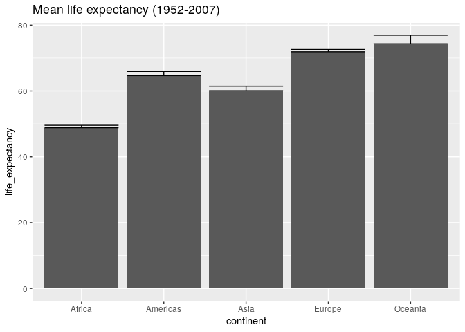

Bicycle
================

**Collapse all chunks with Alt+O / Cmd+Option+O**

Packages.

``` r
library(tidyverse)
#> ── Attaching packages ─────────────────────────────────── tidyverse 1.3.0 ──
#> ✓ ggplot2 3.3.2     ✓ purrr   0.3.4
#> ✓ tibble  3.0.3     ✓ dplyr   1.0.1
#> ✓ tidyr   1.1.1     ✓ stringr 1.4.0
#> ✓ readr   1.3.1     ✓ forcats 0.5.0
#> ── Conflicts ────────────────────────────────────── tidyverse_conflicts() ──
#> x dplyr::filter() masks stats::filter()
#> x dplyr::lag()    masks stats::lag()
library(here)
#> here() starts at /home/rstudio/tidy-ds
library(vroom)
library(fs)
library(glue)
#> 
#> Attaching package: 'glue'
#> The following object is masked from 'package:dplyr':
#> 
#>     collapse
```

This messy dataset comes in multiple files – one per continent:

``` r
paths <- dir_ls(here("data", "by-continent"))
paths
#> /home/rstudio/tidy-ds/data/by-continent/africa.csv
#> /home/rstudio/tidy-ds/data/by-continent/americas.csv
#> /home/rstudio/tidy-ds/data/by-continent/asia.csv
#> /home/rstudio/tidy-ds/data/by-continent/europe.csv
#> /home/rstudio/tidy-ds/data/by-continent/oceania.csv
```

You can use `map_df()` to interactively call `read_csv()` on each path.

``` r
paths %>% map_df(read_csv)
#> # A tibble: 142 x 38
#>    continent country gdpPercap_1952 gdpPercap_1957 gdpPercap_1962 gdpPercap_1967
#>    <chr>     <chr>            <dbl>          <dbl>          <dbl>          <dbl>
#>  1 Africa    Algeria          2449.          3014.          2551.          3247.
#>  2 Africa    Angola           3521.          3828.          4269.          5523.
#>  3 Africa    Benin            1063.           960.           949.          1036.
#>  4 Africa    Botswa…           851.           918.           984.          1215.
#>  5 Africa    Burkin…           543.           617.           723.           795.
#>  6 Africa    Burundi           339.           380.           355.           413.
#>  7 Africa    Camero…          1173.          1313.          1400.          1508.
#>  8 Africa    Centra…          1071.          1191.          1193.          1136.
#>  9 Africa    Chad             1179.          1308.          1390.          1197.
#> 10 Africa    Comoros          1103.          1211.          1407.          1876.
#> # … with 132 more rows, and 32 more variables: gdpPercap_1972 <dbl>,
#> #   gdpPercap_1977 <dbl>, gdpPercap_1982 <dbl>, gdpPercap_1987 <dbl>,
#> #   gdpPercap_1992 <dbl>, gdpPercap_1997 <dbl>, gdpPercap_2002 <dbl>,
#> #   gdpPercap_2007 <dbl>, lifeExp_1952 <dbl>, lifeExp_1957 <dbl>,
#> #   lifeExp_1962 <dbl>, lifeExp_1967 <dbl>, lifeExp_1972 <dbl>,
#> #   lifeExp_1977 <dbl>, lifeExp_1982 <dbl>, lifeExp_1987 <dbl>,
#> #   lifeExp_1992 <dbl>, lifeExp_1997 <dbl>, lifeExp_2002 <dbl>,
#> #   lifeExp_2007 <dbl>, pop_1952 <dbl>, pop_1957 <dbl>, pop_1962 <dbl>,
#> #   pop_1967 <dbl>, pop_1972 <dbl>, pop_1977 <dbl>, pop_1982 <dbl>,
#> #   pop_1987 <dbl>, pop_1992 <dbl>, pop_1997 <dbl>, pop_2002 <dbl>,
#> #   pop_2007 <dbl>
```

But `vroom()` does this faster and in one step (it’s “vectorized” over
`file`).

  - Read the data from all `paths` into a single data frame with
    `vroom()`.
  - Store the result as `messy` and `glimpse()` it.

<!-- end list -->

``` r
messy <- _____(paths)
messy %>% _______()
```

    #> Rows: 142
    #> Columns: 38
    #> Delimiter: ","
    #> chr [ 2]: continent, country
    #> dbl [36]: gdpPercap_1952, gdpPercap_1957, gdpPercap_1962, gdpPercap_1967, gdpPercap_1972, ...
    #> 
    #> Use `spec()` to retrieve the guessed column specification
    #> Pass a specification to the `col_types` argument to quiet this message
    #> Rows: 142
    #> Columns: 38
    #> $ continent      <chr> "Africa", "Africa", "Africa", "Africa", "Africa", "Afr…
    #> $ country        <chr> "Algeria", "Angola", "Benin", "Botswana", "Burkina Fas…
    #> $ gdpPercap_1952 <dbl> 2449.0082, 3520.6103, 1062.7522, 851.2411, 543.2552, 3…
    #> $ gdpPercap_1957 <dbl> 3013.9760, 3827.9405, 959.6011, 918.2325, 617.1835, 37…
    #> $ gdpPercap_1962 <dbl> 2550.8169, 4269.2767, 949.4991, 983.6540, 722.5120, 35…
    #> $ gdpPercap_1967 <dbl> 3246.9918, 5522.7764, 1035.8314, 1214.7093, 794.8266, …
    #> $ gdpPercap_1972 <dbl> 4182.6638, 5473.2880, 1085.7969, 2263.6111, 854.7360, …
    #> $ gdpPercap_1977 <dbl> 4910.4168, 3008.6474, 1029.1613, 3214.8578, 743.3870, …
    #> $ gdpPercap_1982 <dbl> 5745.1602, 2756.9537, 1277.8976, 4551.1421, 807.1986, …
    #> $ gdpPercap_1987 <dbl> 5681.3585, 2430.2083, 1225.8560, 6205.8839, 912.0631, …
    #> $ gdpPercap_1992 <dbl> 5023.2166, 2627.8457, 1191.2077, 7954.1116, 931.7528, …
    #> $ gdpPercap_1997 <dbl> 4797.2951, 2277.1409, 1232.9753, 8647.1423, 946.2950, …
    #> $ gdpPercap_2002 <dbl> 5288.0404, 2773.2873, 1372.8779, 11003.6051, 1037.6452…
    #> $ gdpPercap_2007 <dbl> 6223.3675, 4797.2313, 1441.2849, 12569.8518, 1217.0330…
    #> $ lifeExp_1952   <dbl> 43.077, 30.015, 38.223, 47.622, 31.975, 39.031, 38.523…
    #> $ lifeExp_1957   <dbl> 45.685, 31.999, 40.358, 49.618, 34.906, 40.533, 40.428…
    #> $ lifeExp_1962   <dbl> 48.303, 34.000, 42.618, 51.520, 37.814, 42.045, 42.643…
    #> $ lifeExp_1967   <dbl> 51.407, 35.985, 44.885, 53.298, 40.697, 43.548, 44.799…
    #> $ lifeExp_1972   <dbl> 54.518, 37.928, 47.014, 56.024, 43.591, 44.057, 47.049…
    #> $ lifeExp_1977   <dbl> 58.014, 39.483, 49.190, 59.319, 46.137, 45.910, 49.355…
    #> $ lifeExp_1982   <dbl> 61.368, 39.942, 50.904, 61.484, 48.122, 47.471, 52.961…
    #> $ lifeExp_1987   <dbl> 65.799, 39.906, 52.337, 63.622, 49.557, 48.211, 54.985…
    #> $ lifeExp_1992   <dbl> 67.744, 40.647, 53.919, 62.745, 50.260, 44.736, 54.314…
    #> $ lifeExp_1997   <dbl> 69.152, 40.963, 54.777, 52.556, 50.324, 45.326, 52.199…
    #> $ lifeExp_2002   <dbl> 70.994, 41.003, 54.406, 46.634, 50.650, 47.360, 49.856…
    #> $ lifeExp_2007   <dbl> 72.301, 42.731, 56.728, 50.728, 52.295, 49.580, 50.430…
    #> $ pop_1952       <dbl> 9279525, 4232095, 1738315, 442308, 4469979, 2445618, 5…
    #> $ pop_1957       <dbl> 10270856, 4561361, 1925173, 474639, 4713416, 2667518, …
    #> $ pop_1962       <dbl> 11000948, 4826015, 2151895, 512764, 4919632, 2961915, …
    #> $ pop_1967       <dbl> 12760499, 5247469, 2427334, 553541, 5127935, 3330989, …
    #> $ pop_1972       <dbl> 14760787, 5894858, 2761407, 619351, 5433886, 3529983, …
    #> $ pop_1977       <dbl> 17152804, 6162675, 3168267, 781472, 5889574, 3834415, …
    #> $ pop_1982       <dbl> 20033753, 7016384, 3641603, 970347, 6634596, 4580410, …
    #> $ pop_1987       <dbl> 23254956, 7874230, 4243788, 1151184, 7586551, 5126023,…
    #> $ pop_1992       <dbl> 26298373, 8735988, 4981671, 1342614, 8878303, 5809236,…
    #> $ pop_1997       <dbl> 29072015, 9875024, 6066080, 1536536, 10352843, 6121610…
    #> $ pop_2002       <dbl> 31287142, 10866106, 7026113, 1630347, 12251209, 702107…
    #> $ pop_2007       <dbl> 33333216, 12420476, 8078314, 1639131, 14326203, 839050…

This messy dataset is hard to work with but not impossible. Let’s study
the mean life expectancy through time.

Let’s focus on `continent` and all columns that `start_with()`
“lifeExp”:

    #> # A tibble: 142 x 13
    #>    continent lifeExp_1952 lifeExp_1957 lifeExp_1962 lifeExp_1967 lifeExp_1972
    #>    <chr>            <dbl>        <dbl>        <dbl>        <dbl>        <dbl>
    #>  1 Africa            43.1         45.7         48.3         51.4         54.5
    #>  2 Africa            30.0         32.0         34           36.0         37.9
    #>  3 Africa            38.2         40.4         42.6         44.9         47.0
    #>  4 Africa            47.6         49.6         51.5         53.3         56.0
    #>  5 Africa            32.0         34.9         37.8         40.7         43.6
    #>  6 Africa            39.0         40.5         42.0         43.5         44.1
    #>  7 Africa            38.5         40.4         42.6         44.8         47.0
    #>  8 Africa            35.5         37.5         39.5         41.5         43.5
    #>  9 Africa            38.1         39.9         41.7         43.6         45.6
    #> 10 Africa            40.7         42.5         44.5         46.5         48.9
    #> # … with 132 more rows, and 7 more variables: lifeExp_1977 <dbl>,
    #> #   lifeExp_1982 <dbl>, lifeExp_1987 <dbl>, lifeExp_1992 <dbl>,
    #> #   lifeExp_1997 <dbl>, lifeExp_2002 <dbl>, lifeExp_2007 <dbl>

The prefix “lifeExp” is redundant and we could remove it.

``` r
remove_prefix <- function(.x) str_replace(.x, "lifeExp_", "")

life_exp1 <- life_exp %>% 
  rename_with(remove_prefix)

# Same with the `~` shortcut, like in `map()` and friends
life_exp1 <- life_exp %>% 
  rename_with(~str_replace(.x, "lifeExp_", ""))

life_exp1
#> # A tibble: 142 x 13
#>    continent `1952` `1957` `1962` `1967` `1972` `1977` `1982` `1987` `1992`
#>    <chr>      <dbl>  <dbl>  <dbl>  <dbl>  <dbl>  <dbl>  <dbl>  <dbl>  <dbl>
#>  1 Africa      43.1   45.7   48.3   51.4   54.5   58.0   61.4   65.8   67.7
#>  2 Africa      30.0   32.0   34     36.0   37.9   39.5   39.9   39.9   40.6
#>  3 Africa      38.2   40.4   42.6   44.9   47.0   49.2   50.9   52.3   53.9
#>  4 Africa      47.6   49.6   51.5   53.3   56.0   59.3   61.5   63.6   62.7
#>  5 Africa      32.0   34.9   37.8   40.7   43.6   46.1   48.1   49.6   50.3
#>  6 Africa      39.0   40.5   42.0   43.5   44.1   45.9   47.5   48.2   44.7
#>  7 Africa      38.5   40.4   42.6   44.8   47.0   49.4   53.0   55.0   54.3
#>  8 Africa      35.5   37.5   39.5   41.5   43.5   46.8   48.3   50.5   49.4
#>  9 Africa      38.1   39.9   41.7   43.6   45.6   47.4   49.5   51.1   51.7
#> 10 Africa      40.7   42.5   44.5   46.5   48.9   50.9   52.9   54.9   57.9
#> # … with 132 more rows, and 3 more variables: `1997` <dbl>, `2002` <dbl>,
#> #   `2007` <dbl>
```

(The resulting names are non-syntactic so R surrounds them in backticks.
Such names are awkward and you should avoid them. As you will soon see,
here we won’t refer to them directly; instead we’ll use the tidyselect
helpers – see `?select()`.)

  - Use `summarize()` to get the `mean` `across()` all columns except
    `continent`.

<!-- end list -->

``` r
life_exp1 %>% 
  _________(across(-_________, mean))
```

    #> # A tibble: 1 x 12
    #>   `1952` `1957` `1962` `1967` `1972` `1977` `1982` `1987` `1992` `1997` `2002`
    #>    <dbl>  <dbl>  <dbl>  <dbl>  <dbl>  <dbl>  <dbl>  <dbl>  <dbl>  <dbl>  <dbl>
    #> 1   49.1   51.5   53.6   55.7   57.6   59.6   61.5   63.2   64.2   65.0   65.7
    #> # … with 1 more variable: `2007` <dbl>

  - Now iterate over each `continent`, by grouping column-wise with
    `group_by()`.
  - Compute across `everything()` (the grouping variable is excluded by
    default).
  - Compute the number of observations per group (use `n = n()`).
  - Relocate the `n` column to the front with `relocate()`.
  - Store the result as `by_continent`.

<!-- end list -->

``` r
by_continent <- life_exp1 %>% 
  ________(continent) %>% 
  summarize(across(everything(), mean), n = n()) %>% 
  ________(n)

by_continent
```

    #> `summarise()` ungrouping output (override with `.groups` argument)
    #> # A tibble: 5 x 14
    #>       n continent `1952` `1957` `1962` `1967` `1972` `1977` `1982` `1987` `1992`
    #>   <int> <chr>      <dbl>  <dbl>  <dbl>  <dbl>  <dbl>  <dbl>  <dbl>  <dbl>  <dbl>
    #> 1    52 Africa      39.1   41.3   43.3   45.3   47.5   49.6   51.6   53.3   53.6
    #> 2    25 Americas    53.3   56.0   58.4   60.4   62.4   64.4   66.2   68.1   69.6
    #> 3    33 Asia        46.3   49.3   51.6   54.7   57.3   59.6   62.6   64.9   66.5
    #> 4    30 Europe      64.4   66.7   68.5   69.7   70.8   71.9   72.8   73.6   74.4
    #> 5     2 Oceania     69.3   70.3   71.1   71.3   71.9   72.9   74.3   75.3   76.9
    #> # … with 3 more variables: `1997` <dbl>, `2002` <dbl>, `2007` <dbl>

  - Now iterate over each year, by grouping row-wise with `rowwise()`.
  - Create the new column `life_expectancy`: as `mean(c_across())`
  - Create the new column `se`() standard error) as `sd(c_across()) /
    sqrt(n)`.

(See `?c_across()` – its like `across()` but works with `rowwise()`.)

``` r
total <- by_continent %>% 
  _______(continent) %>% 
  _________(life_expectancy = ____(c_across()), se = __(c_across()) / sqrt(_))

total
```

    #> `summarise()` regrouping output by 'continent', 'n' (override with `.groups` argument)
    #> # A tibble: 5 x 4
    #> # Groups:   continent, n [5]
    #>   continent     n life_expectancy    se
    #>   <chr>     <int>           <dbl> <dbl>
    #> 1 Africa       52            48.9 0.723
    #> 2 Americas     25            64.7 1.28 
    #> 3 Asia         33            60.1 1.37 
    #> 4 Europe       30            71.9 0.707
    #> 5 Oceania       2            74.3 2.60

  - Create a bar-plot (`?geom_col()`) of `continent` versus
    `life_expectancy`.
  - Use `geom_errorbar()` to show uncertainty as `life_expectancy + se`.
  - Add this title with `labs()`: “Mean life expectancy (1952-2007)”.

<!-- end list -->

``` r
total %>% 
  ggplot(___(_________, life_expectancy)) +
  geom____() +
  _____________(aes(ymin = life_expectancy, ymax = _______________ + se)) +
  ____(_____ = "Mean life expectancy (1952-2007)")
```

<!-- -->

That was hard work. R is column-oriented so it’s best to first tidy the
data.
