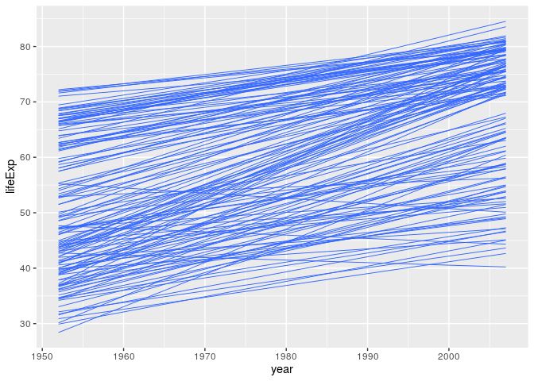
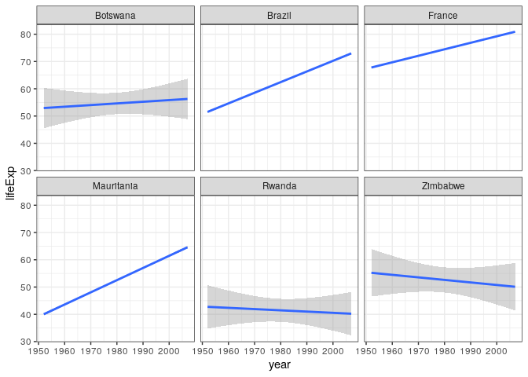
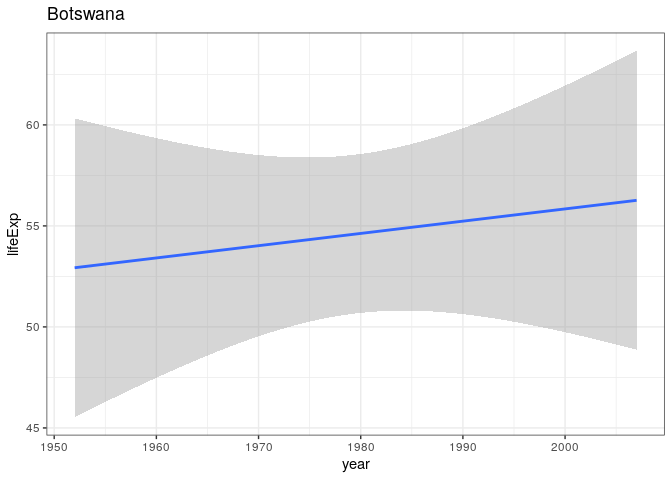

Car
================

**Collapse all chunks with Alt+O / Cmd+Option+O**

Packages.

``` r
library(tidyverse)
#> ── Attaching packages ──────────────────────────────────── tidyverse 1.3.0 ──
#> ✓ ggplot2 3.3.2     ✓ purrr   0.3.4
#> ✓ tibble  3.0.3     ✓ dplyr   1.0.1
#> ✓ tidyr   1.1.1     ✓ stringr 1.4.0
#> ✓ readr   1.3.1     ✓ forcats 0.5.0
#> ── Conflicts ─────────────────────────────────────── tidyverse_conflicts() ──
#> x dplyr::filter() masks stats::filter()
#> x dplyr::lag()    masks stats::lag()
library(here)
#> here() starts at /home/rstudio/tidy-ds
library(vroom)
library(fs)
library(broom)
library(glue)
#> 
#> Attaching package: 'glue'
#> The following object is masked from 'package:dplyr':
#> 
#>     collapse
```

`vroom()` reads multiple datasets into a single data frame, elegantly
and fast:

``` r
paths <- dir_ls(here("data", "by-continent"))
messy <- suppressMessages(vroom(paths))
messy
#> # A tibble: 142 x 38
#>    continent country gdpPercap_1952 gdpPercap_1957 gdpPercap_1962 gdpPercap_1967
#>    <chr>     <chr>            <dbl>          <dbl>          <dbl>          <dbl>
#>  1 Africa    Algeria          2449.          3014.          2551.          3247.
#>  2 Africa    Angola           3521.          3828.          4269.          5523.
#>  3 Africa    Benin            1063.           960.           949.          1036.
#>  4 Africa    Botswa…           851.           918.           984.          1215.
#>  5 Africa    Burkin…           543.           617.           723.           795.
#>  6 Africa    Burundi           339.           380.           355.           413.
#>  7 Africa    Camero…          1173.          1313.          1400.          1508.
#>  8 Africa    Centra…          1071.          1191.          1193.          1136.
#>  9 Africa    Chad             1179.          1308.          1390.          1197.
#> 10 Africa    Comoros          1103.          1211.          1407.          1876.
#> # … with 132 more rows, and 32 more variables: gdpPercap_1972 <dbl>,
#> #   gdpPercap_1977 <dbl>, gdpPercap_1982 <dbl>, gdpPercap_1987 <dbl>,
#> #   gdpPercap_1992 <dbl>, gdpPercap_1997 <dbl>, gdpPercap_2002 <dbl>,
#> #   gdpPercap_2007 <dbl>, lifeExp_1952 <dbl>, lifeExp_1957 <dbl>,
#> #   lifeExp_1962 <dbl>, lifeExp_1967 <dbl>, lifeExp_1972 <dbl>,
#> #   lifeExp_1977 <dbl>, lifeExp_1982 <dbl>, lifeExp_1987 <dbl>,
#> #   lifeExp_1992 <dbl>, lifeExp_1997 <dbl>, lifeExp_2002 <dbl>,
#> #   lifeExp_2007 <dbl>, pop_1952 <dbl>, pop_1957 <dbl>, pop_1962 <dbl>,
#> #   pop_1967 <dbl>, pop_1972 <dbl>, pop_1977 <dbl>, pop_1982 <dbl>,
#> #   pop_1987 <dbl>, pop_1992 <dbl>, pop_1997 <dbl>, pop_2002 <dbl>,
#> #   pop_2007 <dbl>
```

Do the same step by step and compare the results:

  - Create a list of data frames, mapping each path to `vroom()` with
    `map()`.
  - Use the `~` syntax to suppress the messages from `vroom()`.
  - Reduce `reduce()` the list to a single data frame with
    `bind_rows()`.
  - Pipe the output into `identical()` and compare it with `messy`.

<!-- end list -->

``` r
paths %>% 
  ___(~ suppressMessages(_____(.x))) %>%
  reduce(_________) %>% 
  reduce(bind_rows) %>% 
  _________(messy)
```

    #> [1] TRUE

Create a longer dataset with a numeric column `year`, and one column per
metric:

  - Pivot, separate, and mutate `year`.
  - Pivot again to move each metric to its own column.

<!-- end list -->

``` r
tidy <- messy %>% 
  ____________(where(is.numeric)) %>% 
  ________(____, into = c("name", "year")) %>% 
  ______(year = as.numeric(____)) %>% 
  ___________(names_from = name)

tidy
```

    #> # A tibble: 1,704 x 6
    #>    continent country  year gdpPercap lifeExp      pop
    #>    <chr>     <chr>   <dbl>     <dbl>   <dbl>    <dbl>
    #>  1 Africa    Algeria  1952     2449.    43.1  9279525
    #>  2 Africa    Algeria  1957     3014.    45.7 10270856
    #>  3 Africa    Algeria  1962     2551.    48.3 11000948
    #>  4 Africa    Algeria  1967     3247.    51.4 12760499
    #>  5 Africa    Algeria  1972     4183.    54.5 14760787
    #>  6 Africa    Algeria  1977     4910.    58.0 17152804
    #>  7 Africa    Algeria  1982     5745.    61.4 20033753
    #>  8 Africa    Algeria  1987     5681.    65.8 23254956
    #>  9 Africa    Algeria  1992     5023.    67.7 26298373
    #> 10 Africa    Algeria  1997     4797.    69.2 29072015
    #> # … with 1,694 more rows

## Pick years

  - Pick years in the (inclusive) range
    `params$min_year`-`params$max_year`.

<!-- end list -->

``` r
picked <- tidy %>% 
  ______(____ >= min(params$year), year <= max(______$____))
```

## Plot linear models

Plot a linear model of life expectancy through time:

  - Map `group` to `country` (what happens if you don’t).
  - Use `geom_smooth()`; use the “lm” `method`.
  - For clarity, remote the `se` shade, and reduce `alpha` and `size` to
    1/3.

<!-- end list -->

``` r
picked %>% 
  ggplot(aes(____, lifeExp, group = _______)) +
  ___________(method = "__", se = _____, alpha = ___, ____ = 1/3)
```

    #> `geom_smooth()` using formula 'y ~ x'

<!-- -->

## Compute linear models: The list approach

> What if you actually want those mods? To access estimates, p-values,
> etc. In that case, you need to fit them yourself. How to do that? –
> <https://jennybc.github.io/purrr-tutorial/ls13_list-columns.html>

Put the variables needed for country-specific models into nested data
frame:

  - Use `group_by()` and `nest()` to create a list column with the
    `country` data.
  - You may inspect the list `nested$data` with `View()`.

<!-- end list -->

``` r
nested <- picked %>% 
  ________(country) %>% 
  ____()

nested
```

``` r
nested <- picked %>% 
  group_by(country) %>% 
  nest()

nested
#> # A tibble: 142 x 2
#> # Groups:   country [142]
#>    country                  data             
#>    <chr>                    <list>           
#>  1 Algeria                  <tibble [12 × 5]>
#>  2 Angola                   <tibble [12 × 5]>
#>  3 Benin                    <tibble [12 × 5]>
#>  4 Botswana                 <tibble [12 × 5]>
#>  5 Burkina Faso             <tibble [12 × 5]>
#>  6 Burundi                  <tibble [12 × 5]>
#>  7 Cameroon                 <tibble [12 × 5]>
#>  8 Central African Republic <tibble [12 × 5]>
#>  9 Chad                     <tibble [12 × 5]>
#> 10 Comoros                  <tibble [12 × 5]>
#> # … with 132 more rows
```

  - Use `map()` inside `mutate()` to fit linear models of `lifeExp`
    versus `year`.

<!-- end list -->

``` r
mods <- nested %>% 
  ______(mod = ___(data, ~ lm(_______ ~ year, data = .x)))

mods
```

    #> # A tibble: 142 x 3
    #> # Groups:   country [142]
    #>    country                  data              mod   
    #>    <chr>                    <list>            <list>
    #>  1 Algeria                  <tibble [12 × 5]> <lm>  
    #>  2 Angola                   <tibble [12 × 5]> <lm>  
    #>  3 Benin                    <tibble [12 × 5]> <lm>  
    #>  4 Botswana                 <tibble [12 × 5]> <lm>  
    #>  5 Burkina Faso             <tibble [12 × 5]> <lm>  
    #>  6 Burundi                  <tibble [12 × 5]> <lm>  
    #>  7 Cameroon                 <tibble [12 × 5]> <lm>  
    #>  8 Central African Republic <tibble [12 × 5]> <lm>  
    #>  9 Chad                     <tibble [12 × 5]> <lm>  
    #> 10 Comoros                  <tibble [12 × 5]> <lm>  
    #> # … with 132 more rows

  - Use `map()` inside `mutate()`; apply `broom::tidy()` to get model
    parameters.
  - Remove the needless columns `data` and `mod`.
  - `unnest()` the `params` column.

<!-- end list -->

``` r
mods %>% 
  mutate(params = map(mod, broom::tidy)) %>% 
  select(-data, -mod) %>% 
  unnest(params)
#> # A tibble: 284 x 6
#> # Groups:   country [142]
#>    country      term          estimate std.error statistic  p.value
#>    <chr>        <chr>            <dbl>     <dbl>     <dbl>    <dbl>
#>  1 Algeria      (Intercept) -1068.       43.8      -24.4   3.07e-10
#>  2 Algeria      year            0.569     0.0221    25.7   1.81e-10
#>  3 Angola       (Intercept)  -377.       46.6       -8.08  1.08e- 5
#>  4 Angola       year            0.209     0.0235     8.90  4.59e- 6
#>  5 Benin        (Intercept)  -613.       38.9      -15.8   2.18e- 8
#>  6 Benin        year            0.334     0.0196    17.0   1.04e- 8
#>  7 Botswana     (Intercept)   -65.5     202.        -0.324 7.53e- 1
#>  8 Botswana     year            0.0607    0.102      0.593 5.66e- 1
#>  9 Burkina Faso (Intercept)  -676.       67.8       -9.97  1.63e- 6
#> 10 Burkina Faso year            0.364     0.0342    10.6   9.05e- 7
#> # … with 274 more rows
```

## Compute linear models: The `rowwise()` approach

> `rowwise()` data frames allow you to solve a variety of modelling
> problems in what I think is a particularly elegant way. –
> <https://dplyr.tidyverse.org/articles/rowwise.html#list-columns-1>

  - Use `nest_by()` to create a row-wise data-frame, nested by
    `country`.

<!-- end list -->

``` r
nested2 <- tidy %>% _______(_______)
nested2
```

    #> # A tibble: 142 x 2
    #> # Rowwise:  country
    #>    country                   data
    #>    <chr>       <list<tbl_df[,5]>>
    #>  1 Afghanistan           [12 × 5]
    #>  2 Albania               [12 × 5]
    #>  3 Algeria               [12 × 5]
    #>  4 Angola                [12 × 5]
    #>  5 Argentina             [12 × 5]
    #>  6 Australia             [12 × 5]
    #>  7 Austria               [12 × 5]
    #>  8 Bahrain               [12 × 5]
    #>  9 Bangladesh            [12 × 5]
    #> 10 Belgium               [12 × 5]
    #> # … with 132 more rows

  - Use `mutate()` without `map()` to pull interesting information out
    of each fitted linear model.
  - Inspect the resulting list column `mod` with `View()`.

<!-- end list -->

``` r
mods2 <- nested2 %>% 
  ______(mod = list(__(_______ ~ year, data = .data$data)))

mods2
```

    #> # A tibble: 142 x 3
    #> # Rowwise:  country
    #>    country                   data mod   
    #>    <chr>       <list<tbl_df[,5]>> <list>
    #>  1 Afghanistan           [12 × 5] <lm>  
    #>  2 Albania               [12 × 5] <lm>  
    #>  3 Algeria               [12 × 5] <lm>  
    #>  4 Angola                [12 × 5] <lm>  
    #>  5 Argentina             [12 × 5] <lm>  
    #>  6 Australia             [12 × 5] <lm>  
    #>  7 Austria               [12 × 5] <lm>  
    #>  8 Bahrain               [12 × 5] <lm>  
    #>  9 Bangladesh            [12 × 5] <lm>  
    #> 10 Belgium               [12 × 5] <lm>  
    #> # … with 132 more rows

  - Use `broom::tidy()` inside `summarise()` to access model parameters.

<!-- end list -->

``` r
parameters2 <- mods2 %>% _________(broom::tidy(___))
parameters2
```

    #> `summarise()` regrouping output by 'country' (override with `.groups` argument)
    #> # A tibble: 284 x 6
    #> # Groups:   country [142]
    #>    country     term         estimate std.error statistic  p.value
    #>    <chr>       <chr>           <dbl>     <dbl>     <dbl>    <dbl>
    #>  1 Afghanistan (Intercept)  -508.     40.5        -12.5  1.93e- 7
    #>  2 Afghanistan year            0.275   0.0205      13.5  9.84e- 8
    #>  3 Albania     (Intercept)  -594.     65.7         -9.05 3.94e- 6
    #>  4 Albania     year            0.335   0.0332      10.1  1.46e- 6
    #>  5 Algeria     (Intercept) -1068.     43.8        -24.4  3.07e-10
    #>  6 Algeria     year            0.569   0.0221      25.7  1.81e-10
    #>  7 Angola      (Intercept)  -377.     46.6         -8.08 1.08e- 5
    #>  8 Angola      year            0.209   0.0235       8.90 4.59e- 6
    #>  9 Argentina   (Intercept)  -390.      9.68       -40.3  2.14e-12
    #> 10 Argentina   year            0.232   0.00489     47.4  4.22e-13
    #> # … with 274 more rows

## Plotting from the model parameters

Here are two ways to get the r.squared from the model of each country:

``` r
# purrr: List approach
country <- mods %>% pluck("country")
rsq <- mods %>% pluck("mod") %>% map(summary) %>% map_dbl("r.squared")
list(country, rsq) %>% map(head)
#> [[1]]
#> [1] "Algeria"      "Angola"       "Benin"        "Botswana"     "Burkina Faso"
#> [6] "Burundi"     
#> 
#> [[2]]
#> [1] 0.9851172 0.8878146 0.9666020 0.0340234 0.9187105 0.7659960

# dplyr: Data frame approach
country_rsq <- mods2 %>% summarise(rsq = summary(mod)$r.squared)
#> `summarise()` regrouping output by 'country' (override with `.groups` argument)
head(country_rsq)
#> # A tibble: 6 x 2
#> # Groups:   country [6]
#>   country       rsq
#>   <chr>       <dbl>
#> 1 Afghanistan 0.948
#> 2 Albania     0.911
#> 3 Algeria     0.985
#> 4 Angola      0.888
#> 5 Argentina   0.996
#> 6 Australia   0.980
```

The data frame approach keeps `country` and `rsq` in sync. This makes it
easy to work with the two vectors at the same time.

  - `ungroup()` the dataset `country_rsq` (what happens if you don’t?).
  - `arrange()` to find the 3 countries with highest and lowest `rsq`.
  - Use `slice_head()` and `pull()` to pull the names of those
    countries.

<!-- end list -->

``` r
high <- country_rsq %>% 
  _______() %>% 
  arrange(____(rsq)) %>% 
  slice_head(n = 3) %>% 
  ____(country)
high

low <- country_rsq %>% 
  ungroup() %>% 
  _______(rsq) %>% 
  __________(n = 3) %>% 
  pull(country)
low
```

    #> [1] "Brazil"     "Mauritania" "France"
    #> [1] "Rwanda"   "Botswana" "Zimbabwe"

Confirm your findings with a plot:

  - `filter()` the `picked` dataset; get countries with the
    highest/lowest `rsq`.
  - Plot a linear model with `geom_smooth()`; keep map `colour` to
    `country`.
  - Facet each `country` into a separate panel.
  - Use `theme_bw()` (or any other theme you like).

<!-- end list -->

``` r
picked %>% 
  filter(country %in% c(high, low)) %>% 
  ggplot(aes(year, lifeExp)) + 
  geom_smooth(method = "lm") +
  facet_wrap(~country) +
  theme_bw()
#> `geom_smooth()` using formula 'y ~ x'
```

<!-- -->

The data frame is a very flexible data structure; it can store anything
in it.

Let’s save each plot in a single .png file. Let’s first create a helper
function to make the plot for each country, and also create the paths to
the plots we’ll soon save.

``` r
make_plot <- function(data, country) {
  data %>% 
    ggplot(aes(year, lifeExp)) + 
    geom_smooth(method = "lm") +
    labs(title = country) +
    theme_bw()
}

# Ensure the parent directory exists, or create it
if (!dir_exists(here("output"))) {
  dir_create(here("output"))
}

# The pronoun `.data` is not strictly necessary but it's more explicit
plots_df <- picked %>% 
  filter(.data$country %in% c(high, low)) %>%
  nest_by(.data$country) %>% 
  summarise(plot = list(make_plot(.data$data, .data$country))) %>% 
  ungroup() %>%
  mutate(filename = here("output", glue("{country}.png"))) %>%
  relocate(filename) %>% 
  select(-.data$country)
#> `summarise()` regrouping output by 'country' (override with `.groups` argument)

plots_df
#> # A tibble: 6 x 2
#>   filename                                    plot  
#>   <chr>                                       <list>
#> 1 /home/rstudio/tidy-ds/output/Botswana.png   <gg>  
#> 2 /home/rstudio/tidy-ds/output/Brazil.png     <gg>  
#> 3 /home/rstudio/tidy-ds/output/France.png     <gg>  
#> 4 /home/rstudio/tidy-ds/output/Mauritania.png <gg>  
#> 5 /home/rstudio/tidy-ds/output/Rwanda.png     <gg>  
#> 6 /home/rstudio/tidy-ds/output/Zimbabwe.png   <gg>
```

Let’s see the first plot:

``` r
plots_df %>% slice_head() %>% pull(plot)
#> [[1]]
#> `geom_smooth()` using formula 'y ~ x'
```

<!-- -->

We can now use both a list and data frame approach to saving the plots:

## List approach to saving multiple plots

`pwalk()` is an extension of `walk2()`; it’s easiest to use when the
names of the list match the names of the arguments of the function you
apply.

``` r
plots_df %>% names()
#> [1] "filename" "plot"

formals(ggsave) %>% names()
#>  [1] "filename"  "plot"      "device"    "path"      "scale"     "width"    
#>  [7] "height"    "units"     "dpi"       "limitsize" "..."
```

  - Use `pwalk()` to apply `ggsave()` over each `filename`.

<!-- end list -->

``` r
_____(plots_df, ______)
```

``` r
pwalk(plots_df, ggsave)
```

Confirm.

``` r
dir_ls(here("output"))
#> /home/rstudio/tidy-ds/output/Botswana.png
#> /home/rstudio/tidy-ds/output/Brazil.png
#> /home/rstudio/tidy-ds/output/France.png
#> /home/rstudio/tidy-ds/output/Mauritania.png
#> /home/rstudio/tidy-ds/output/Rwanda.png
#> /home/rstudio/tidy-ds/output/Zimbabwe.png

# Cleanup
file_delete(dir_ls(here("output")))
```

## Summarise approach to saving multiple plots

You can achieve the same with `rowwise()` and `summarise()`.

  - Use `ggsave()` inside `summarise()` (wrap the output in `list()`).

<!-- end list -->

``` r
plots_df %>% 
  _______() %>% 
  rowwise() %>% 
  _________(list(______(filename, plot)))

# Confirm
dir_ls(here("output"))
```

    #> Saving 7 x 5 in image
    #> `geom_smooth()` using formula 'y ~ x'
    #> Saving 7 x 5 in image
    #> `geom_smooth()` using formula 'y ~ x'
    #> Saving 7 x 5 in image
    #> `geom_smooth()` using formula 'y ~ x'
    #> Saving 7 x 5 in image
    #> `geom_smooth()` using formula 'y ~ x'
    #> Saving 7 x 5 in image
    #> `geom_smooth()` using formula 'y ~ x'
    #> Saving 7 x 5 in image
    #> `geom_smooth()` using formula 'y ~ x'
    #> `summarise()` ungrouping output (override with `.groups` argument)
    #> # A tibble: 6 x 1
    #>   `list(ggsave(filename, plot))`
    #>   <list>                        
    #> 1 <NULL>                        
    #> 2 <NULL>                        
    #> 3 <NULL>                        
    #> 4 <NULL>                        
    #> 5 <NULL>                        
    #> 6 <NULL>
    #> /home/rstudio/tidy-ds/output/Botswana.png
    #> /home/rstudio/tidy-ds/output/Brazil.png
    #> /home/rstudio/tidy-ds/output/France.png
    #> /home/rstudio/tidy-ds/output/Mauritania.png
    #> /home/rstudio/tidy-ds/output/Rwanda.png
    #> /home/rstudio/tidy-ds/output/Zimbabwe.png

  - Knit with params and set the `year` range however you like.

## Takeaways

Import:

  - Use `bind_rows()` to combine two data frames by row.

Transform:

  - Use `group_by()` and `nest()` to create nested data frame.
  - Use `nest_by()` to create a nested data frame with row-wise
    properties.
  - Use `lm()` to fit a linear model to data.
      - With list-columns, use `map()` inside `mutate()`
      - With row-wise data, use `mutate()` or `summarise()` without
        `map()`.
  - Use `slice_*()` to slice specific rows.
  - Use `pull()` to pull the values of a data frame column.
  - Use `arrange()` and maybe `desc()` to reorder rows.
  - Use `relocate()` to reorder columns.
  - Use `ungroup()` when you no longer need the grouping.

Tidy:

  - Use `broom::tidy()` to access the parameters of a model.
  - Use list columns to store anything in a data frame, including plots.

Visualise:

  - Use `geom_smooth()` to plot linear models.
  - Use the argument `group` inside `aes()` to group data.
  - Use `ggsave()` to save ggplots.

Communicate:

  - You may pass multiple values to YAML params with:

<!-- end list -->

``` yaml
params:
  value: [1952, 2007]
```

Other:

  - View lists with `View()` (for data frames, prefer `dplyr::view()` ).
  - Iteration:
      - Use `reduce()` to reduce a list to a single value with a binary
        function.
  - Use `pluck()` to pluck a single element from a vector.
  - `map()` can also extract by name or position
  - Use `pmap()/pwalk()` to apply a function iterating over any number
    of vectors.
  - Use the `walk*()` family to apply functions called primarily for
    side-effects.
