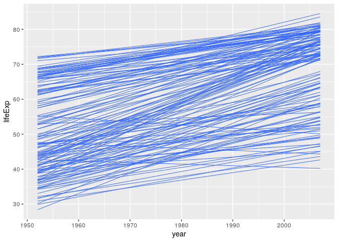

Car
================

**Collapse all chunks with Alt+O / Cmd+Option+O**

Packages.

``` r
library(tidyverse)
#> ── Attaching packages ─────────────────────────────────────────────────── tidyverse 1.3.0 ──
#> ✓ ggplot2 3.3.2     ✓ purrr   0.3.4
#> ✓ tibble  3.0.3     ✓ dplyr   1.0.2
#> ✓ tidyr   1.1.1     ✓ stringr 1.4.0
#> ✓ readr   1.3.1     ✓ forcats 0.5.0
#> ── Conflicts ────────────────────────────────────────────────────── tidyverse_conflicts() ──
#> x dplyr::filter() masks stats::filter()
#> x dplyr::lag()    masks stats::lag()
library(here)
#> here() starts at /home/rstudio-user/tidy-ds
library(vroom)
library(fs)
library(glue)
#> 
#> Attaching package: 'glue'
#> The following object is masked from 'package:dplyr':
#> 
#>     collapse
```

## Import

`vroom()` reads multiple datasets into a single data frame, elegantly
and fast. But let’s do it’s job in a different way, breaking down what
`vroom()` does into steps that help us understand the underlying
iteration problem, and a solution we can latter apply to many other
iteration problems.

Create a vector of paths to read .csv files from:

  - Use `here()` to create a safe path to the folder
    “data/by-continent”.
  - Use `dir_ls()` to create a vector of paths to the .csv files in that
    folder.

<!-- end list -->

``` r
paths <- ______(____("data", "by-continent"))
```

  - `map()` each path to `read_csv` to create a list of data frames.
  - `reduce()` the list of data frames to a single data frame with
    `bind_rows`.

<!-- end list -->

``` r
messy <- paths %>% 
  ___(________) %>%
  ______(bind_rows)

messy
```

    #> # A tibble: 142 x 38
    #>    continent country gdpPercap_1952 gdpPercap_1957 gdpPercap_1962 gdpPercap_1967
    #>    <chr>     <chr>            <dbl>          <dbl>          <dbl>          <dbl>
    #>  1 Africa    Algeria          2449.          3014.          2551.          3247.
    #>  2 Africa    Angola           3521.          3828.          4269.          5523.
    #>  3 Africa    Benin            1063.           960.           949.          1036.
    #>  4 Africa    Botswa…           851.           918.           984.          1215.
    #>  5 Africa    Burkin…           543.           617.           723.           795.
    #>  6 Africa    Burundi           339.           380.           355.           413.
    #>  7 Africa    Camero…          1173.          1313.          1400.          1508.
    #>  8 Africa    Centra…          1071.          1191.          1193.          1136.
    #>  9 Africa    Chad             1179.          1308.          1390.          1197.
    #> 10 Africa    Comoros          1103.          1211.          1407.          1876.
    #> # … with 132 more rows, and 32 more variables: gdpPercap_1972 <dbl>,
    #> #   gdpPercap_1977 <dbl>, gdpPercap_1982 <dbl>, gdpPercap_1987 <dbl>,
    #> #   gdpPercap_1992 <dbl>, gdpPercap_1997 <dbl>, gdpPercap_2002 <dbl>,
    #> #   gdpPercap_2007 <dbl>, lifeExp_1952 <dbl>, lifeExp_1957 <dbl>,
    #> #   lifeExp_1962 <dbl>, lifeExp_1967 <dbl>, lifeExp_1972 <dbl>,
    #> #   lifeExp_1977 <dbl>, lifeExp_1982 <dbl>, lifeExp_1987 <dbl>,
    #> #   lifeExp_1992 <dbl>, lifeExp_1997 <dbl>, lifeExp_2002 <dbl>,
    #> #   lifeExp_2007 <dbl>, pop_1952 <dbl>, pop_1957 <dbl>, pop_1962 <dbl>,
    #> #   pop_1967 <dbl>, pop_1972 <dbl>, pop_1977 <dbl>, pop_1982 <dbl>,
    #> #   pop_1987 <dbl>, pop_1992 <dbl>, pop_1997 <dbl>, pop_2002 <dbl>,
    #> #   pop_2007 <dbl>

## Tidy

Create a longer dataset with a numeric column `year`, and one column per
metric:

  - Pivot over numeric columns.
  - Separate the `metric` column into the new columns “metric” and
    “year”.
  - Mutate the `year` column to numeric.
  - Pivot again, to create a wider data frame with each metric in its
    own column.

<!-- end list -->

``` r
tidy <- messy %>% 
  ____________(_____(is.numeric), names_to = "metric") %>% 
  ________(metric, into = c("metric", "____")) %>% 
  ______(year = __________(year)) %>% 
  ___________(names_from = metric)

tidy
```

    #> # A tibble: 1,704 x 6
    #>    continent country  year gdpPercap lifeExp      pop
    #>    <chr>     <chr>   <dbl>     <dbl>   <dbl>    <dbl>
    #>  1 Africa    Algeria  1952     2449.    43.1  9279525
    #>  2 Africa    Algeria  1957     3014.    45.7 10270856
    #>  3 Africa    Algeria  1962     2551.    48.3 11000948
    #>  4 Africa    Algeria  1967     3247.    51.4 12760499
    #>  5 Africa    Algeria  1972     4183.    54.5 14760787
    #>  6 Africa    Algeria  1977     4910.    58.0 17152804
    #>  7 Africa    Algeria  1982     5745.    61.4 20033753
    #>  8 Africa    Algeria  1987     5681.    65.8 23254956
    #>  9 Africa    Algeria  1992     5023.    67.7 26298373
    #> 10 Africa    Algeria  1997     4797.    69.2 29072015
    #> # … with 1,694 more rows

## Transform

Subset the data you care about:

  - Use `filter()` to pick years in the inclusive range of
    `params$year`.
  - Use `select()` to pick `country`, `year`, and `lifeExp`.

<!-- end list -->

``` r
params$year
#> [1] 1952 2007
```

``` r
picked <- tidy %>% 
  ______(year >= min(______$____) & year <= max(______$____)) %>% 
  ______(country, ____, lifeExp)

picked
```

    #> # A tibble: 1,704 x 3
    #>    country  year lifeExp
    #>    <chr>   <dbl>   <dbl>
    #>  1 Algeria  1952    43.1
    #>  2 Algeria  1957    45.7
    #>  3 Algeria  1962    48.3
    #>  4 Algeria  1967    51.4
    #>  5 Algeria  1972    54.5
    #>  6 Algeria  1977    58.0
    #>  7 Algeria  1982    61.4
    #>  8 Algeria  1987    65.8
    #>  9 Algeria  1992    67.7
    #> 10 Algeria  1997    69.2
    #> # … with 1,694 more rows

## Visualise

Plot a linear model of life expectancy through time:

  - Map `group` to `country` (what happens if you don’t).
  - Use `geom_smooth()`; use the “lm” `method`.
  - For clarity, remote the `se` shade, and reduce `alpha` and `size` to
    1/3.

<!-- end list -->

``` r
picked %>% 
  ggplot(aes(____, lifeExp, group = _______)) +
  ___________(method = "__", se = _____, alpha = ___, ____ = 1/3)
```

    #> `geom_smooth()` using formula 'y ~ x'

<!-- -->

## Model

Let’s explore two ways to get and access the parameters of those models.

`map()` approach:

  - `group_by()` `country` then `nest()`.
  - Call `lm()` inside `map()` inside `mutate()`, mapping the
    list-column `data`.
  - `map_*()` to apply `summary(.x)$r.squared` over the models
    list-column …
  - … do this inside `summarise()`.

<!-- end list -->

``` r
rsq <- tidy %>% 
  ________(country) %>% 
  nest() %>% 
  mutate(mod = ___(data, ~lm(_______ ~ year, data = .x))) %>% 
  _________(rsq = map_dbl(mod, ~summary(.x)$r.squared))

rsq
```

    #> `summarise()` ungrouping output (override with `.groups` argument)
    #> # A tibble: 142 x 2
    #>    country       rsq
    #>    <chr>       <dbl>
    #>  1 Afghanistan 0.948
    #>  2 Albania     0.911
    #>  3 Algeria     0.985
    #>  4 Angola      0.888
    #>  5 Argentina   0.996
    #>  6 Australia   0.980
    #>  7 Austria     0.992
    #>  8 Bahrain     0.967
    #>  9 Bangladesh  0.989
    #> 10 Belgium     0.995
    #> # … with 132 more rows

Rowwise approach:

``` r
rsq2 <- tidy %>% 
  nest_by(country) %>% 
  ______(mod = list(__(_______ ~ year, data = data))) %>% 
  summarise(rsq = _______(mod)$r.squared)

rsq2
```

    #> `summarise()` regrouping output by 'country' (override with `.groups` argument)
    #> # A tibble: 142 x 2
    #> # Groups:   country [142]
    #>    country       rsq
    #>    <chr>       <dbl>
    #>  1 Afghanistan 0.948
    #>  2 Albania     0.911
    #>  3 Algeria     0.985
    #>  4 Angola      0.888
    #>  5 Argentina   0.996
    #>  6 Australia   0.980
    #>  7 Austria     0.992
    #>  8 Bahrain     0.967
    #>  9 Bangladesh  0.989
    #> 10 Belgium     0.995
    #> # … with 132 more rows

## Countries with highest and lowest `rsq`

In the same pipeline:

  - `ungroup()` the dataset `rsq` (what happens if you don’t?).
  - `arrange()` to find order the data set by descending values of `rsq`
  - `print()` to inspect the data at this point.
  - `pull()` the `country` column.

<!-- end list -->

``` r
countries <- rsq %>% 
  _______() %>%
  _______(____(rsq)) %>% 
  _____() %>% 
  ____(country)

head(countries)
```

    #> # A tibble: 142 x 2
    #>    country             rsq
    #>    <chr>             <dbl>
    #>  1 Brazil            0.998
    #>  2 Mauritania        0.998
    #>  3 France            0.998
    #>  4 Switzerland       0.997
    #>  5 Pakistan          0.997
    #>  6 Indonesia         0.997
    #>  7 Equatorial Guinea 0.997
    #>  8 Comoros           0.997
    #>  9 Nicaragua         0.997
    #> 10 Guatemala         0.997
    #> # … with 132 more rows
    #> [1] "Brazil"      "Mauritania"  "France"      "Switzerland" "Pakistan"   
    #> [6] "Indonesia"

  - `filter()` rows of `picked` where `country` is in the `head()` and
    `tail()` of `countries`.

<!-- end list -->

``` r
high_low <- picked %>% 
  ______(country %in% c(____(countries), ____(countries)))

high_low
```

    #> # A tibble: 144 x 3
    #>    country   year lifeExp
    #>    <chr>    <dbl>   <dbl>
    #>  1 Botswana  1952    47.6
    #>  2 Botswana  1957    49.6
    #>  3 Botswana  1962    51.5
    #>  4 Botswana  1967    53.3
    #>  5 Botswana  1972    56.0
    #>  6 Botswana  1977    59.3
    #>  7 Botswana  1982    61.5
    #>  8 Botswana  1987    63.6
    #>  9 Botswana  1992    62.7
    #> 10 Botswana  1997    52.6
    #> # … with 134 more rows

## Do our models agree with those we get with ggplo2?

If so, our models with high (low) `rsq` should fit the data tightly
(loosely).

Let’s plot the countries with the 6 highest and 6 lowest values of
`rsq`.

``` r
make_plot <- function(data) {
  ggplot(data, aes(year, lifeExp)) + 
    geom_smooth(method = "lm") +
    facet_wrap(~country) +
    theme_bw()
}
```

We can use this helper function to plot all plots at once:

``` r
high_low %>% make_plot()
#> `geom_smooth()` using formula 'y ~ x'
```

<!-- -->

We can also apply it to a list split by `country`, and save each plot to
a file:

  - `split()` `high_low` by `country`.
  - `map()` to apply `make_plot`.
  - Use `ggsave()` inside `iwalk()`, mapping the argument `plot` to
    `.x`., and the argument `filename` to paths in the “output” folder.
    Create such paths with `here()`, where the name of each .png files
    should come from mapping `.y` like so: `glue("{.y}.png")`.

<!-- end list -->

``` r
high_low %>% 
  _____(.$country) %>% 
  map(_________) %>% 
  _____(~ ggsave(filename = here("output", glue("{__}.png")), plot = .x))
```

    #> Saving 7 x 5 in image
    #> `geom_smooth()` using formula 'y ~ x'
    #> Saving 7 x 5 in image
    #> `geom_smooth()` using formula 'y ~ x'
    #> Saving 7 x 5 in image
    #> `geom_smooth()` using formula 'y ~ x'
    #> Saving 7 x 5 in image
    #> `geom_smooth()` using formula 'y ~ x'
    #> Saving 7 x 5 in image
    #> `geom_smooth()` using formula 'y ~ x'
    #> Saving 7 x 5 in image
    #> `geom_smooth()` using formula 'y ~ x'
    #> Saving 7 x 5 in image
    #> `geom_smooth()` using formula 'y ~ x'
    #> Saving 7 x 5 in image
    #> `geom_smooth()` using formula 'y ~ x'
    #> Saving 7 x 5 in image
    #> `geom_smooth()` using formula 'y ~ x'
    #> Saving 7 x 5 in image
    #> `geom_smooth()` using formula 'y ~ x'
    #> Saving 7 x 5 in image
    #> `geom_smooth()` using formula 'y ~ x'
    #> Saving 7 x 5 in image
    #> `geom_smooth()` using formula 'y ~ x'

  - Knit with different parameters and inspect the output.

## Takeaways

Import:

  - `vrooms()` is like `many_csv %>% map(read_csv) %>%
    reduce(bind_rows)`.

Transform:

  - Use `nest_by()` to create a nested data frame with row-wise
    properties.
  - Use `lm()` to fit a linear model to data.
      - With list-columns, use `map()` inside `mutate()`
      - With row-wise data, use `mutate()` or `summarise()` without
        `map()`.
  - Use `pull()` to pull the values of a data frame column.
  - Use `arrange()` and maybe `desc()` to reorder rows.
  - Use `ungroup()` when you no longer need the grouping.

Tidy:

  - Nest data frames: what happens in the data frame, stays in the data
    frame.

Visualise:

  - Use `geom_smooth()` to plot linear models.
  - Use `ggsave()` to save ggplots.

Communicate:

  - You may pass multiple values to YAML prams with:

<!-- end list -->

``` yaml
params:
  value: [1952, 2007]
```

Iteration:

  - Use `View()` to view lists (for data frames, prefer `dplyr::view()`
    ).
      - Use `reduce()` to reduce a list to a single value with a binary
        function.
      - Use the `walk*()` family to apply side-effect functions.
      - Use `iwalk()` as short hand for `map2(x, names(x), ...)`
