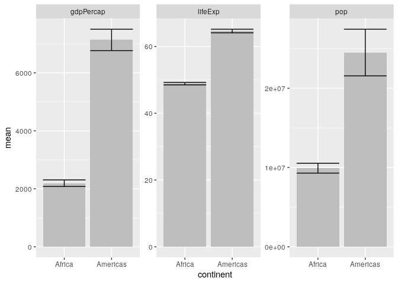

Whole game
================

**Collapse all chunks with Alt+O/Cmd+Option+O**

## rmarkdown <https://rmarkdown.rstudio.com/>

  - Output a github\_document.

  - Set your favorite chunk options: `collapse`, `cache`, `comments`,
    and `error`.

## Packages <https://www.tidyverse.org/>

  - Use tidyverse packages.

  - Your may also use the packages fs and vroom.

<!-- end list -->

``` r
library(_________)
```

``` r
library(tidyverse)
#> ── Attaching packages ──────────────────────────────── tidyverse 1.3.0 ──
#> ✓ ggplot2 3.3.2     ✓ purrr   0.3.4
#> ✓ tibble  3.0.3     ✓ dplyr   1.0.1
#> ✓ tidyr   1.1.1     ✓ stringr 1.4.0
#> ✓ readr   1.3.1     ✓ forcats 0.5.0
#> ── Conflicts ─────────────────────────────────── tidyverse_conflicts() ──
#> x dplyr::filter() masks stats::filter()
#> x dplyr::lag()    masks stats::lag()
library(here)
#> here() starts at /home/rstudio/tidy-ds
library(fs)
library(vroom)
```

## Import <https://readr.tidyverse.org/>

  - Read all datasets in “data/by-continent/” into a single `messy`
    tibble.

<!-- end list -->

``` r
csv_files <- dir_ls(____("data", "____________"))
messy <- vroom(csv_files)
messy <- vroom(_________)

messy
```

``` r
csv_files <- dir_ls(here("data", "by-continent"))
messy <- vroom(csv_files)
#> Rows: 142
#> Columns: 38
#> Delimiter: ","
#> chr [ 2]: continent, country
#> dbl [36]: gdpPercap_1952, gdpPercap_1957, gdpPercap_1962, gdpPercap_1967, gdpPercap_1972, ...
#> 
#> Use `spec()` to retrieve the guessed column specification
#> Pass a specification to the `col_types` argument to quiet this message

messy
#> # A tibble: 142 x 38
#>    continent country gdpPercap_1952 gdpPercap_1957 gdpPercap_1962 gdpPercap_1967
#>    <chr>     <chr>            <dbl>          <dbl>          <dbl>          <dbl>
#>  1 Africa    Algeria          2449.          3014.          2551.          3247.
#>  2 Africa    Angola           3521.          3828.          4269.          5523.
#>  3 Africa    Benin            1063.           960.           949.          1036.
#>  4 Africa    Botswa…           851.           918.           984.          1215.
#>  5 Africa    Burkin…           543.           617.           723.           795.
#>  6 Africa    Burundi           339.           380.           355.           413.
#>  7 Africa    Camero…          1173.          1313.          1400.          1508.
#>  8 Africa    Centra…          1071.          1191.          1193.          1136.
#>  9 Africa    Chad             1179.          1308.          1390.          1197.
#> 10 Africa    Comoros          1103.          1211.          1407.          1876.
#> # … with 132 more rows, and 32 more variables: gdpPercap_1972 <dbl>,
#> #   gdpPercap_1977 <dbl>, gdpPercap_1982 <dbl>, gdpPercap_1987 <dbl>,
#> #   gdpPercap_1992 <dbl>, gdpPercap_1997 <dbl>, gdpPercap_2002 <dbl>,
#> #   gdpPercap_2007 <dbl>, lifeExp_1952 <dbl>, lifeExp_1957 <dbl>,
#> #   lifeExp_1962 <dbl>, lifeExp_1967 <dbl>, lifeExp_1972 <dbl>,
#> #   lifeExp_1977 <dbl>, lifeExp_1982 <dbl>, lifeExp_1987 <dbl>,
#> #   lifeExp_1992 <dbl>, lifeExp_1997 <dbl>, lifeExp_2002 <dbl>,
#> #   lifeExp_2007 <dbl>, pop_1952 <dbl>, pop_1957 <dbl>, pop_1962 <dbl>,
#> #   pop_1967 <dbl>, pop_1972 <dbl>, pop_1977 <dbl>, pop_1982 <dbl>,
#> #   pop_1987 <dbl>, pop_1992 <dbl>, pop_1997 <dbl>, pop_2002 <dbl>,
#> #   pop_2007 <dbl>
```

## Transform (part 1) <https://dplyr.tidyverse.org/>

  - Select all numeric columns – i.e. exclude `continent` and `country`.

  - Slice a sample of 5 rows.

  - Pull the contents of the pull the first column – the values are not
    round.

<!-- end list -->

``` r
messy %>% 
  select(!_________ & !_______) %>% 
  slice_sample(n = _) %>% 
  pull(_)
```

``` r
messy %>% 
  select(!continent & !country) %>% 
  slice_sample(n = 5) %>% 
  pull(1)
#> [1]   853.5409   406.8841   375.6431 14734.2327  3035.3260
```

  - Round values across numeric columns.

  - Store the result as `messy2`.

<!-- end list -->

``` r
______2 <- messy %>% 
  mutate(______(where(is._______), round))

messy2
```

``` r
messy2 <- messy %>% 
  mutate(across(where(is.numeric), round))

messy2
#> # A tibble: 142 x 38
#>    continent country gdpPercap_1952 gdpPercap_1957 gdpPercap_1962 gdpPercap_1967
#>    <chr>     <chr>            <dbl>          <dbl>          <dbl>          <dbl>
#>  1 Africa    Algeria           2449           3014           2551           3247
#>  2 Africa    Angola            3521           3828           4269           5523
#>  3 Africa    Benin             1063            960            949           1036
#>  4 Africa    Botswa…            851            918            984           1215
#>  5 Africa    Burkin…            543            617            723            795
#>  6 Africa    Burundi            339            380            355            413
#>  7 Africa    Camero…           1173           1313           1400           1508
#>  8 Africa    Centra…           1071           1191           1193           1136
#>  9 Africa    Chad              1179           1308           1390           1197
#> 10 Africa    Comoros           1103           1211           1407           1876
#> # … with 132 more rows, and 32 more variables: gdpPercap_1972 <dbl>,
#> #   gdpPercap_1977 <dbl>, gdpPercap_1982 <dbl>, gdpPercap_1987 <dbl>,
#> #   gdpPercap_1992 <dbl>, gdpPercap_1997 <dbl>, gdpPercap_2002 <dbl>,
#> #   gdpPercap_2007 <dbl>, lifeExp_1952 <dbl>, lifeExp_1957 <dbl>,
#> #   lifeExp_1962 <dbl>, lifeExp_1967 <dbl>, lifeExp_1972 <dbl>,
#> #   lifeExp_1977 <dbl>, lifeExp_1982 <dbl>, lifeExp_1987 <dbl>,
#> #   lifeExp_1992 <dbl>, lifeExp_1997 <dbl>, lifeExp_2002 <dbl>,
#> #   lifeExp_2007 <dbl>, pop_1952 <dbl>, pop_1957 <dbl>, pop_1962 <dbl>,
#> #   pop_1967 <dbl>, pop_1972 <dbl>, pop_1977 <dbl>, pop_1982 <dbl>,
#> #   pop_1987 <dbl>, pop_1992 <dbl>, pop_1997 <dbl>, pop_2002 <dbl>,
#> #   pop_2007 <dbl>
```

## Tidy <https://tidyr.tidyverse.org/>

  - Pivot the data on all columns except `continent` and `country`.

  - Separate the messy column into `metric` and `year`.

<!-- end list -->

``` r
tidy <- messy2 %>% 
  pivot_______(cols = -c(_________, country)) %>% 
  ________(col = name, into = c("______", "____"))

tidy
```

``` r
tidy <- messy2 %>% 
  pivot_longer(cols = -c(continent, country)) %>% 
  separate(col = name, into = c("metric", "year"))

tidy
#> # A tibble: 5,112 x 5
#>    continent country metric    year  value
#>    <chr>     <chr>   <chr>     <chr> <dbl>
#>  1 Africa    Algeria gdpPercap 1952   2449
#>  2 Africa    Algeria gdpPercap 1957   3014
#>  3 Africa    Algeria gdpPercap 1962   2551
#>  4 Africa    Algeria gdpPercap 1967   3247
#>  5 Africa    Algeria gdpPercap 1972   4183
#>  6 Africa    Algeria gdpPercap 1977   4910
#>  7 Africa    Algeria gdpPercap 1982   5745
#>  8 Africa    Algeria gdpPercap 1987   5681
#>  9 Africa    Algeria gdpPercap 1992   5023
#> 10 Africa    Algeria gdpPercap 1997   4797
#> # … with 5,102 more rows
```

## Transform (part 2) <https://dplyr.tidyverse.org/>

  - Filter the `metrics` and `continents` passed passed to `params`.

  - Mutate the year column from character to integer as `tidy2`.

<!-- end list -->

``` r
tidy2 <- tidy %>% 
  ______(metric %in% ______$metrics, _________ %in% ______$continents) %>% 
  ______(year = as._______(____))

tidy2
```

``` r
tidy2 <- tidy %>% 
  filter(metric %in% params$metrics, continent %in% params$continents) %>% 
  mutate(year = as.integer(year))

tidy2
#> # A tibble: 2,772 x 5
#>    continent country metric     year value
#>    <chr>     <chr>   <chr>     <int> <dbl>
#>  1 Africa    Algeria gdpPercap  1952  2449
#>  2 Africa    Algeria gdpPercap  1957  3014
#>  3 Africa    Algeria gdpPercap  1962  2551
#>  4 Africa    Algeria gdpPercap  1967  3247
#>  5 Africa    Algeria gdpPercap  1972  4183
#>  6 Africa    Algeria gdpPercap  1977  4910
#>  7 Africa    Algeria gdpPercap  1982  5745
#>  8 Africa    Algeria gdpPercap  1987  5681
#>  9 Africa    Algeria gdpPercap  1992  5023
#> 10 Africa    Algeria gdpPercap  1997  4797
#> # … with 2,762 more rows
```

  - For each `metric` and `continent`, compute the mean and standard
    error.

<!-- end list -->

``` r
summaries <- tidy2 %>% 
  group_by(______, _________) %>% 
  _________(mean = mean(value), se = sd(_____) / sqrt(n()))

summaries
```

``` r
summaries <- tidy2 %>% 
  group_by(metric, continent) %>% 
  summarise(mean = mean(value), se = sd(value) / sqrt(n()))
#> `summarise()` regrouping output by 'metric' (override with `.groups` argument)

summaries
#> # A tibble: 6 x 4
#> # Groups:   metric [3]
#>   metric    continent       mean          se
#>   <chr>     <chr>          <dbl>       <dbl>
#> 1 gdpPercap Africa        2194.      113.   
#> 2 gdpPercap Americas      7136.      369.   
#> 3 lifeExp   Africa          48.9       0.367
#> 4 lifeExp   Americas        64.6       0.540
#> 5 pop       Africa     9916003.   620133.   
#> 6 pop       Americas  24504795.  2943299.
```

## Visualize <https://ggplot2.tidyverse.org/>

Plot a model for each metric through time:

  - Map `color` and `fill` to `continent`.
  - Plot model with uncertainty around the mean.
  - Facet by `metric` (free the `y` variable – see `?scales`).

<!-- end list -->

``` r
______(tidy2, ___(year, value, fill = _________, color = _________)) +
  geom_______() +
  ______wrap(~ ______, scales = "free_y")
```

``` r
ggplot(tidy2, aes(year, value, fill = continent, color = continent)) +
  geom_point() +
  geom_smooth() +
  facet_wrap(~ metric, scales = "free_y")
#> `geom_smooth()` using method = 'loess' and formula 'y ~ x'
```

<!-- -->

Plot the mean of each metric by continent:

  - Set the `fill` to “grey”.
  - Plot the standard error to show uncertainty around the mean.
  - Facet by `metric` (free the `y` variable – see `?scales`).

<!-- end list -->

``` r
ggplot(summaries, aes(_________, ____)) +
  geom____(fill = "____") +
  geom_________(aes(ymin = mean + __, ____ = mean - se)) +
  ______wrap(~ ______, ______ = "free_y")
```

``` r
ggplot(summaries, aes(continent, mean)) +
  geom_col(fill = "grey") +
  geom_errorbar(aes(ymin = mean + se, ymax = mean - se)) +
  facet_wrap(~ metric, scales = "free_y")
```

<!-- -->

## Communicate <https://rmarkdown.rstudio.com/>

  - Knit to create a report in .pdf format, then in word format.

TODO: purrr::walk to produce one report per continent.
